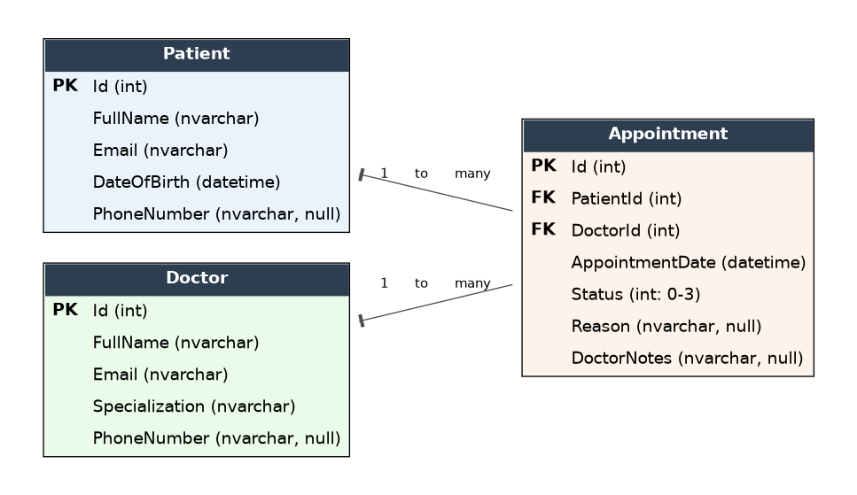
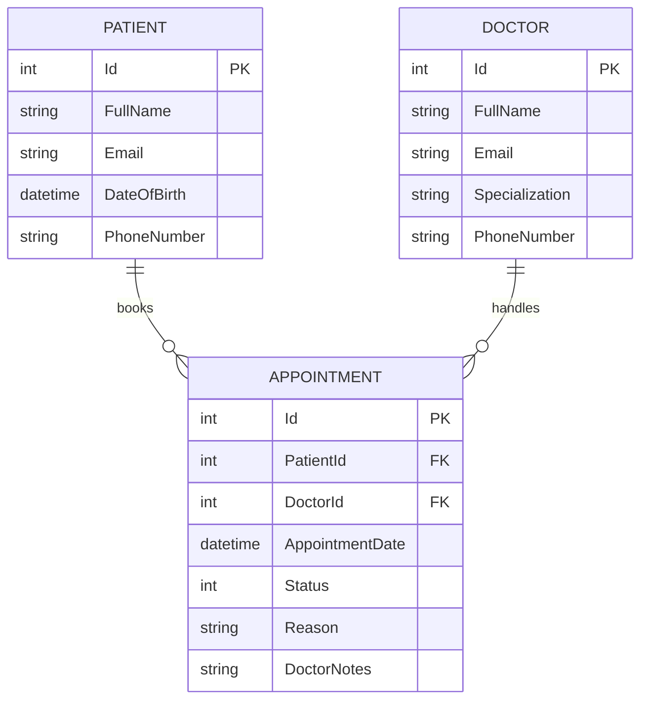

# Clinic Management System — Full Project

A graduation-project-sized Clinic Management System with two roles — **Patient**
and **Doctor** — built as three clean, separate layers:

```
Frontend (plain HTML/CSS/JS)  --->  Api (ASP.NET Core 8 + EF Core)  --->  Database (SQL Server)
```


## Project structure

```
ClinicManagementSystem/
├── Api/                      → ASP.NET Core Web API + EF Core (backend)
│   ├── Controllers/
│   ├── Models/
│   ├── Data/
│   ├── DTOs/
│   └── Program.cs
├── Frontend/                 → Static HTML/CSS/JS client (no frameworks)
│   ├── index.html            → Landing page (choose Patient / Doctor)
│   ├── patient/               → login.html, dashboard.html
│   ├── doctor/                 → login.html, dashboard.html
│   ├── js/api.js                → API client (fetch wrapper)
│   └── assets/                   → app.css + background image
├── Database/
│   └── Schema.sql             → Raw T-SQL: tables, FKs, seed data
└── Docs/
    ├── ERD-Diagram.png
    └── ERD-Diagram.svg
```

## Entity-Relationship Diagram





**Relationships:** one Patient → many Appointments; one Doctor → many
Appointments. `Appointment` is the join entity carrying the booking workflow
state (`Status`: 0 Pending, 1 Approved, 2 Rejected, 3 Completed).

## Setup — step by step (ready to run, in order)

### 1. Create the database
You only need **one** of these two options — don't run both against the same database.

**Option A — run the SQL script directly** (fastest, no EF tooling needed)
```bash
sqlcmd -S (localdb)\mssqllocaldb -i Database/Schema.sql
```
or open `Database/Schema.sql` in SQL Server Management Studio / Azure Data
Studio, connect to your SQL Server / LocalDB instance, and execute it.
This creates the `ClinicManagementDb` database, all three tables, foreign
keys, and seed data (2 sample doctors, 1 sample patient) — ready to use
immediately.

**Option B — EF Core migrations** (if you want to demonstrate Code-First EF instead)
```bash

dotnet tool install --global dotnet-ef   # only needed once
dotnet ef migrations add InitialCreate
dotnet ef database update
```

By default the API connects to `(localdb)\mssqllocaldb` (see
`Api/appsettings.json` → `ConnectionStrings:ClinicDb`). If you're using a
different SQL Server instance, update that connection string first.

### 2. Run the API
```bash
cd Api
dotnet restore
dotnet run
```
This starts the API on **`http://localhost:5100`** (plain HTTP — no dev
certificate to trust, no extra setup). Swagger UI opens automatically at
`http://localhost:5100/swagger` so you can test every endpoint before
touching the frontend.

CORS is already enabled for any origin, so the frontend can call the API
from a different port with no extra configuration.

### 3. Run the frontend
Serve the `Frontend` folder with any static file server (don't just
double-click the `.html` files — `fetch()` behaves inconsistently from a
`file://` origin in some browsers):

```bash
cd Frontend
python -m http.server 5500
# or: npx serve .
# or: use VS Code's "Live Server" extension
```
Then open `http://localhost:5500` in your browser.

If you change the API's port, update `API_BASE_URL` at the top of
`Frontend/js/api.js` to match.

## Using the app
1. Open the frontend → choose **Patient** or **Doctor**.
2. **Patient:** register (or sign in with `sara.ahmed@example.com`, the seeded
   sample patient), pick a doctor, request an appointment, and watch its
   status change once a doctor responds.
3. **Doctor:** sign in with one of the seeded doctors
   (`amina.salah@clinic.com` or `omar.farid@clinic.com`), approve/reject
   pending requests, and mark approved ones as completed with notes.

> **Note on login:** there's no password/authentication layer — signing in
> just looks the person up by email. That keeps the project focused on the
> core CRUD + workflow logic EF Core and Web API are meant to demonstrate. If
> your course requires real authentication, adding ASP.NET Identity + JWT is
> the natural next step (not included, to keep scope reasonable).

## Business rules enforced by the API
- A patient can't have more than one active (Pending/Approved) appointment at once.
- A doctor can't be double-booked at the exact same date/time.
- Appointments must be booked for a future date/time.
- A patient/doctor with existing appointments can't be deleted.

## Tech stack
- **Backend:** ASP.NET Core 8 Web API, Entity Framework Core 8 (Code-First), SQL Server
- **Frontend:** Plain HTML5, CSS3, vanilla JavaScript (`fetch` API, no libraries)
- **Database:** SQL Server / LocalDB
